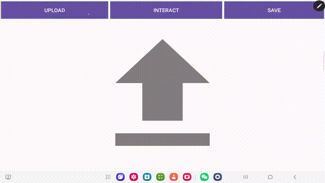

# Dune Interactive Segmentation

An interactive segmentation application for dune images combining Python deep learning models (FenGePad-Model) with Android mobile implementation

We implemented the backend with reference to the FenGePad-Model project. Please pull the backend project before using mine. Project link:

https://github.com/nicezheng/FenGePad-Model

Please add or replace the model files used in this project to the original FenGePad-Model project. Relevant link:

https://github.com/warmrid233/dune_seg_model

## Demo


## Contents
- [Project Overview](#project-overview)
- [Requirements](#requirements)
- [Quick Start](#quick-start)
- [User Guide](#user-guide)
- [Development Documentation](#development-documentation)
- [Contribution Guidelines](#contribution-guidelines)
- [License](#license)

## Project Overview
An interactive segmentation system for dune geomorphology implemented with Android mobile client and Python deep learning backend. Main features include:

- 📱 Android Features:
  - Local image capture
  - Interactive segmentation annotation
  - Result visualization and export
- 🖥️ Backend Features:
  - Semantic segmentation based on [FenGePad-Model]
  - Interactive mask optimization

**Tech Stack**:
- Backend: Python [3.8+] + flask + PyTorch
- Mobile: Android [14.0(API-34)+]

## Requirements
**Backend Service**:
- PyCharm 2023.3.1+
- Python 3.8+
- PyTorch 2.4.1+
- CUDA [12.7] (Recommended for GPU acceleration)(Select version according to GPU)

Install dependencies:
```bash
pip install -r requirements.txt
```

**Android Client**:
- Android Studio 2023.3+
- Android SDK 34+
- Java JDK 17+
- Gradle 8.6+
- Device requirements: Android 14.0+, supports Camera2 API

## Quick Start
**Launch Backend Service**:
- Run in PyCharm with following run/debug configuration:
```bash
script:
*(your path)\android demo\android_controller.py
```

**Build Android Application**:
- Open project in Android Studio
- Set JDK to version 17 and sync Gradle dependencies
- Run on device/emulator

## User Guide
**Interaction Flow**:
- Launch Android app and model backend
- Input model endpoint IP and port for connection test
- Enter main interface, select image source from gallery
- Enter interaction interface, use left-side buttons for operations (adjust image, click interaction, connection line, brush, undo, complete interaction, save & exit)
- After selecting save & exit, return to main interface and save processed image to gallery

**Gesture Operations**:
- When adjusting image:
Single finger/stylus drag: Pan image
Two-finger pinch/spread: Zoom image

- When click interacting:
Single finger/stylus tap: Add positive/negative points

- When connection line interacting:
Single finger/stylus tap: Add connection nodes, draw connection line

- When brush interacting:
Single finger/stylus drag: Draw lines

- Undo/Complete interaction/Save & exit: Click corresponding buttons

## Development Documentation
**Model Training**:
- Refer to FenGePad-Model project for model training methods:
https://github.com/nicezheng/FenGePad-Model

**API Specification**:
|Endpoint           |Method           |Parameter Format            |Function               |
|:---           |:---           |:---               |:---              |
|/test          |GET            |null               |Test connection between Android and model|
|/load_img      |POST           |FormData(image: File, name: String, type: String)|Upload image from Android|
|/click         |POST           |FormData(x: Float, y: Float, flag: Int)          |Upload click interaction data from Android|
|/get_image     |GET            |null               |Get processed image from backend model|
|/finish        |GET            |null               |Execute segmentation and save segmentation results|
|/paint         |Post           |FormData(image: File, name: String, type: String)|Upload paint image from Android|

## Contribution Guidelines
- Welcome contributions via Issues or Pull Requests. Please follow:
- Create feature branch: git checkout -b feature/your-feature
- Submit clear commit messages
- Maintain consistent code style between Android and Python code

## License
Apache 2.0 © 2025 [Haonan Kang, Zheng Jiang, Yi Wang, ]

## Notes:
- Ensure Android device and backend server are on same local network
- Recommended to use RTX 3060 or better GPU for accelerated inference
- Training data should include diverse dune geomorphology samples
